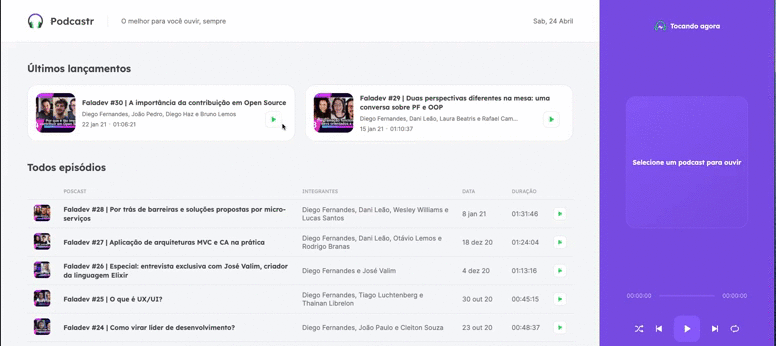

## Frontend React - Podcastr

Podcastr é um projeto construído em React com TypeScript, utilizando NextJS, durante Next Level Week #05 da Rocketseat 

## Requisitos

```
Nodejs >= 10
```
## Preview




## Como Iniciar?

1.  **Faça o clone do repositório.**

    ```
      git clone https://github.com/geraldobl58/podcast-nextjs.git
    ```

1.  **Instalação das dependências**

   execute na pasta do projeto o seguinte comando:

    ```npm install ou yarn
    ```

    após a instalação execute o seguinte comando.

    ```npm run start ou yarn start
    Observação: em uma nova aba execute => yarn server
    (Aba 1) => yarn dev
    (Aba 2) => yarn server
    ```

1.  **Verificando no navegador**

    O projeto vai executar no seguinte endereço: `http://localhost:3000`

## Techs


 - [x] [React](https://pt-br.reactjs.org/)
 - [x] [Typescript](https://pt-br.reactjs.org/)
 - [x] [NextJS](https://nextjs.org/)
 - [x] [Axios](https://github.com/axios/axios)
 - [x] [Date FNS](https://date-fns.org/)
 - [x] [RC Slider](https://www.npmjs.com/package/rc-slider)
 - [x] [SASS](https://sass-lang.com/)

## Diretórios

Estrutura do projeto.

    .
    ├── node_modules
    ├── src
    ├──────── components
    ├──────── contexts
    ├──────── pages
    ├──────── services
    ├──────── styles
    ├──────── utils
    ├── .gitignore
    ├── package.json
    └── README.md